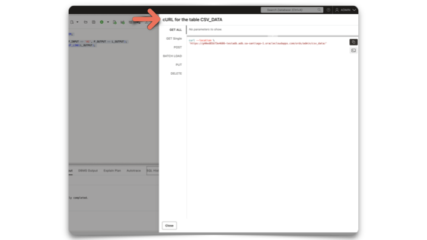
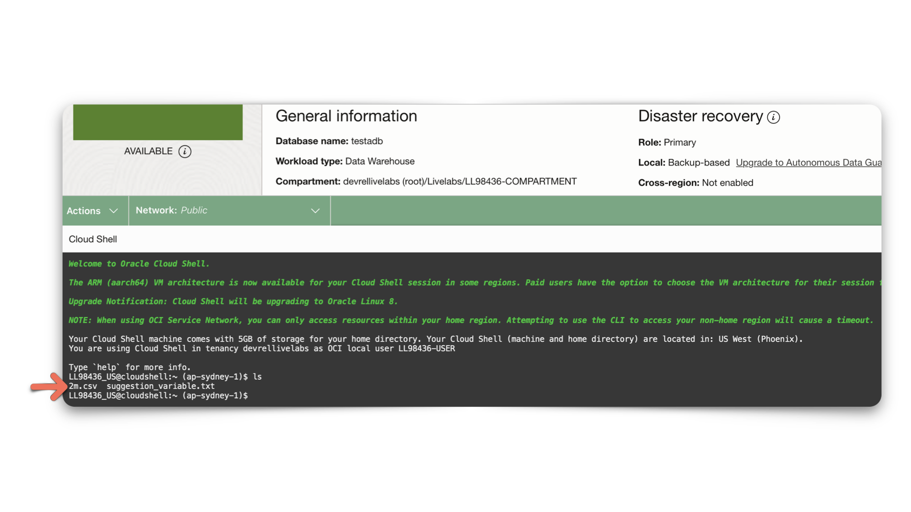
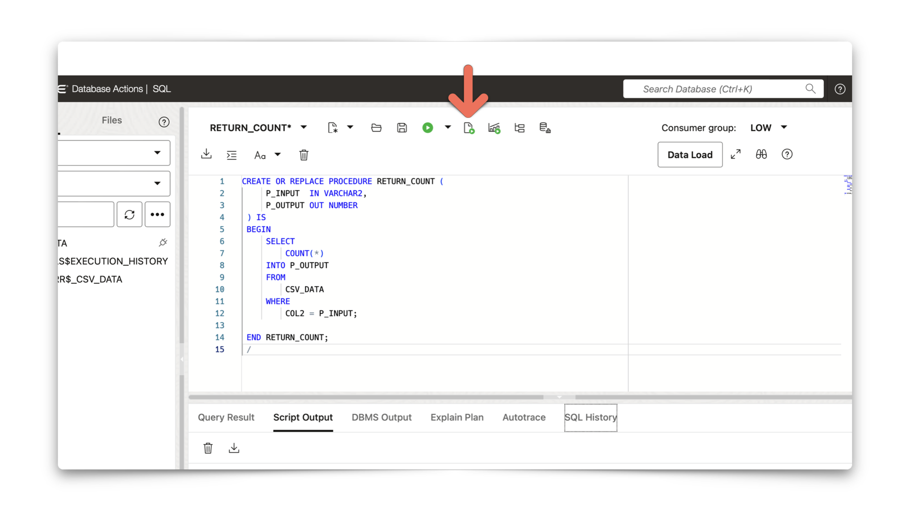
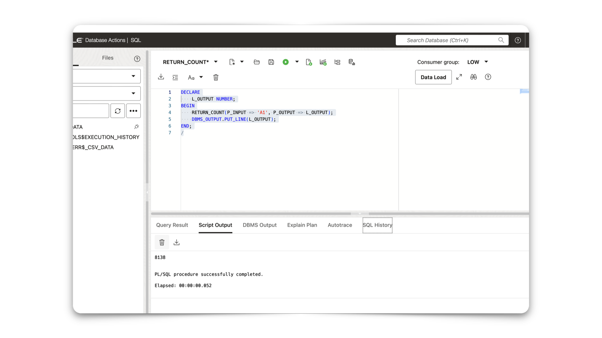

# Batch load data and create business logic
<!-- WMSID 4602 -->
## Introduction

In this lab you will use the `BATCH LOAD` API to load large amounts of data into a table.

Estimated Lab Time: 20 minutes

Watch the video below for a quick walk-through of the lab.
[Load data and create business logic](videohub:1_rgksftgt)

### Objectives

- Load a CSV file, consisting of over 2 million rows, into the `CSV_DATA` table
- Create a PL/SQL procedure to simulate a business operation

### Prerequisites

- The following lab requires an [Oracle Cloud account](https://www.oracle.com/cloud/free/). You may use your own cloud account, a cloud account that you obtained through a trial, or a training account whose details were given to you by an Oracle instructor.

- This Lab assumes you have completed all previous Labs.

## Task 1: Load data into the database

1. Navigate to the **cURL slide out** of the `CSV_DATA` table.

    

2. Once the cURL command slider appears, click `BATCH LOAD`.

    

    Left click the **BATCH LOAD** side tab.

    

3. Click the copy icon for the **BATCH LOAD** endpoint.

    

      The cURL command should resemble the following:

      ```sh
      <copy>curl --location --request POST \       
      --header "Content-Type: <CONTENT_TYPE>" \
      --data-binary @<FILE_NAME> \
      'https://coolrestlab-adb21.adb.eu-frankfurt-1.oraclecloudapps.com/ords/admin/csv_data/ batchload'</copy> 
      ```

    > **IMPORTANT:** Save this code in a text editor or a notes application!

4. Open the **Oracle Cloud Infrastructure Cloud Shell** or a local computer shell.

    > **NOTE:** If you are using a local computer shell, you must have cURL installed! See [Downloading cURL](https://curl.se/download.html " ") for instructions.

    <details>
    <summary>*How do I access the Cloud Shell?*</summary>

      > [Learn more](https://www.oracle.com/devops/cloud-shell/) about Oracle Cloud Shell.

      1. Once logged-in to your Oracle Cloud Infrastructure account, click the Cloud Shell icon in the upper right of the Oracle Cloud Infrastructure banner:

         

      2. The Cloud Shell will open on the lower part of the web browser:

         

      3. We will be using the Oracle Cloud Infrastructure Cloud Shell for examples in this lab going forward.

    </details>

5. Download the CSV file using Cloud Shell or locally with the following command:

    ```sh
    <copy>curl -o 2M.csv https://c4u04.objectstorage.us-ashburn-1.oci.customer-oci.com/p/EcTjWk2IuZPZeNnD_fYMcgUhdNDIDA6rt9gaFj_WZMiL7VvxPBNMY60837hu5hga/n/c4u04/b/livelabsfiles/o/developer-library/2M.csv</copy>
    ```

6. The file should now be saved locally.  

   It can now be loaded into the database. With the cURL command found in Step 3, include the following:  
  
     - `--write-out '%{time_total}'`
     - `--data-binary "@2M.csv"` so that the cURL application knows which file to upload
     - `-H "Content-Type:text/csv` to specify a Content Type header
     - `--user "admin:[your password]"` with your own admin credentials  

      

7. Once the changes have been made, your cURL command should resemble:

    ```sh
    <copy>curl --write-out '%{time_total}' -X POST --data-binary "@2M.csv" \
    -H "Content-Type:text/csv" \
    --user "admin:123456ZAQWSX!!" \
    "https://coolrestlab-adb21.adb.eu-frankfurt-1.oraclecloudapps.com/ords/admin/csv_data/batchload?batchRows=5000&errorsMax=20"</copy>
    ```

8. Using the **Cloud Shell**, **paste** your constructed cURL at the **command prompt**.

    

   > **NOTE:** Before executing this cURL command, ensure you `"cd"` to the directory where your `2M.csv` file is located.  

      

9. When the **command is finished**, you should see that all over **2 millions rows** were inserted into the table.  

  

> **CONSIDER THIS:** In this example, a CSV with over 2 million rows was batchloaded to a tenancy in Sydney, Australia in under 50 seconds. This information comes courtesy of the **--write-out '%{time_total}'** option, included in the cURL command.

## Task 2: Adding business logic

1. We'll now create a PLSQL procedure to act as mock "business logic." Perhaps this business logic might be used for an enterprise application or internal tool.  

   The following `RETURN_COUNT` procedure returns a count of all the rows that match the input (<i>aka</i> `P_INPUT`) provided to `COL2` (<i>Column 2</i>) in the `CSV_DATA` table:

   ```sql
   <copy>CREATE OR REPLACE PROCEDURE RETURN_COUNT (
        P_INPUT  IN VARCHAR2,
        P_OUTPUT OUT NUMBER
    ) IS
    BEGIN
        SELECT
            COUNT(*)
        INTO P_OUTPUT
        FROM
            CSV_DATA
        WHERE
            COL2 = P_INPUT;

    END RETURN_COUNT;
    /</copy>
    ```

2. Copy and paste this code into the SQL Worksheet and left click the **Run Script** button on the toolbar:

    

3. Now, you can "sample" this procedure; and simulate what a user (i.e., client application) might input or POST in an HTTP POST request.  

   Copy and paste the following code block and execute it in the SQL Worksheet using the **Run Script** button:

      ```sql
      <copy>DECLARE
          L_OUTPUT NUMBER;
      BEGIN
          RETURN_COUNT(P_INPUT => 'A1', P_OUTPUT => L_OUTPUT);
          DBMS_OUTPUT.PUT_LINE(L_OUTPUT);
      END;
      /</copy>
      ```

   

4. You should see a result in the `Script Output` tab, similar to the one in the above image.  

   In the next lab, you'll create your own ORDS APIs; to include the business logic you just created here.

You may now [proceed to the next lab](#next).

## Acknowledgements

### Author

- Jeff Smith, Distinguished Product Manager
- Chris Hoina, Senior Product Manager

### Last Updated By/Date

- Chris Hoina, August 2024