# Work with Data Auditing

## Introduction

This chapter describes how to work with audit tools in Enterprise Data Quality. The demonstration environment includes several examples on EDQ Audit tools.

*Estimated Lab Time*: 15 minutes

### Objectives
In this chapter you will explore the below features in EDQ:
* No Data Check - Verifies if the attribute has data
* Pattern Check - Identify the data based on patterns
* List Check - Identify records matching a list

### Prerequisites
This lab assumes you have:
- A Free Tier, Paid or LiveLabs Oracle Cloud account
- You have completed:
    - Lab: Prepare Setup (*Free-tier* and *Paid Tenants* only)
    - Lab: Environment Setup
    - Lab: Initialize Environment
    - Lab: Data Profiling
    - Lab: Reference Data

## Task 1: No Data Check

### Auditing Data

We will now begin to create a new Process for Auditing our US Customer data. The reference data that we just created in the past few steps, will be utilized by some of the out-of-the-box "Audit Processors" within our Audit (data checking) process.
1.	Return to the "Project Browser" in the left side of your "Director" window, and underneath your project right-click on “Processes” and click “New Process…”.

    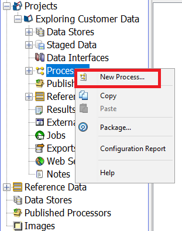

2.	Select “US Customer Data”, then click “Next”. Click “Next” on the next screen (we will not add any profiling here). Provide the following Data:
    - Name: Auditing Customer Data
    - Description: Auditing Customer Data  <Not Mandatory>

    Click “Finish” to continue.

    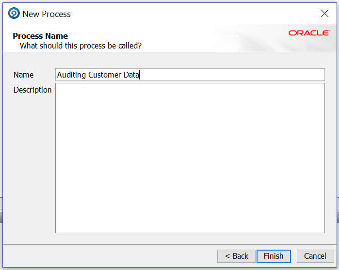

3.	As with the first process we created, a "Reader Processor" is automatically added to the "Project Canvas". In the "Tool Palette" find the “Audit” category.

4.	First, drag and drop a “No Data Check” processor onto the "Process Canvas".

    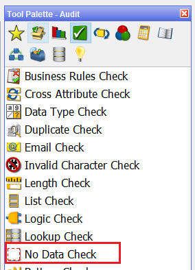

5.	Right click on the "No Data Check" processor and select “Rename” to re-name it to “Email Populated” and press the enter key.

    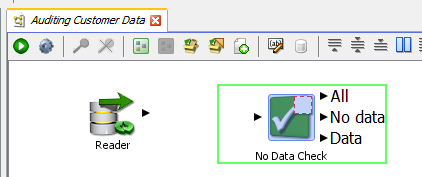

    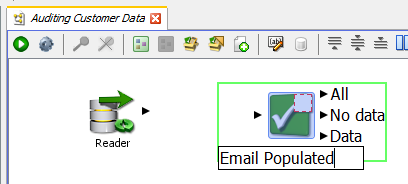

6.	Drag and Drop the end triangle from the “Reader” to your newly named “Email Populated” audit processor. The "Email Populated" configuration dialog appears on screen.

    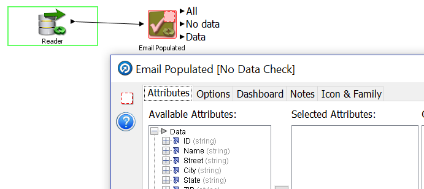

7.	Select “eMail” from “Available Attributes” and click the ">" button to add it to “Selected Attributes”, click "OK".

    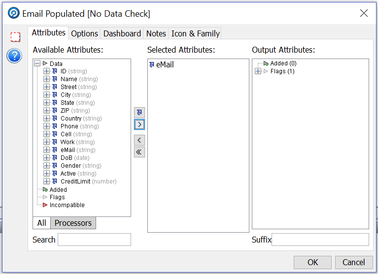

8.	Click the “Run” icon in the toolbar (top of the Project Canvas) to run the process. Once it finishes, select the “Email Populated” audit processor to view the results.

    

**Note**: If desired, we can continue to develop this process using one or more of the end point output data stream triangles from the Processor by choosing “Data”, “No Data” or “All".

## Task 2: Pattern Check

1.	Now, find the “Pattern Check” processor in the Tool Palette. Drag and drop it into the canvas and rename it to “Cell Number in Right Format” by double clicking on processor.

    

2.	Connect the “All” end triangle from “Email Populated” to the “Cell Number in Right Format” processor. The configuration dialog for the "Pattern Check" processor appears on screen.

3.	Select “CELL” from “Available Attributes” as the “Field for validation” using the ">" icon.

    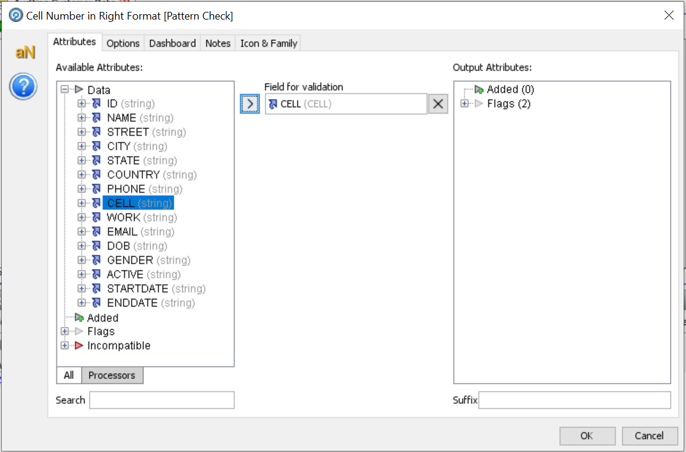

4.	Click the “Options” tab at the top of the dialog box, then click the "..."  button in the “Invalid Patterns” section in the middle of the window.

    

5.	Uncheck “Filter by Category” in the “Select Resource” applet. This is where you will select the Reference Data we created for the different types of invalid cell number patterns. Click on “Invalid Cell Pattern”, then click “OK”.

    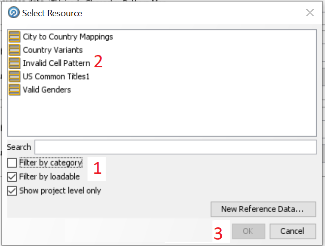

6.	In the section under “Invalid Patterns”, click the drop-down box to change “Categorize unmatched as” to “Valid”, then click “OK” to continue.

    

7.	Click the “Run” icon in the toolbar (top of the Project Canvas) to run the process. Once it finishes, click the “Cell Number in Right Format” processor to view the results.

    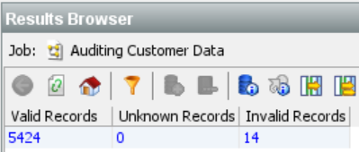

    Notice that there are 5424 Valid Records and 14 Invalid Records.

## Task 3: List Check

1.	Return to the "Tool Palette" and find the “List Check” processor. Drag and drop it onto the "Project Canvas".

2.	Link the “All” triangle from “Cell Number in Right Format” to the “List Check” processor, the “List Check” dialog comes up. Select “Gender” in “Available Attributes” and click on the ">" icon to add it to the “Selected Attributes”.

    

3.	Click the “Options” tab in the top of the dialog box to add reference data. On the section “Valid Values” click on the "..." button.

    

4.	Select the “Valid Genders” reference data, then click “OK” to continue.

    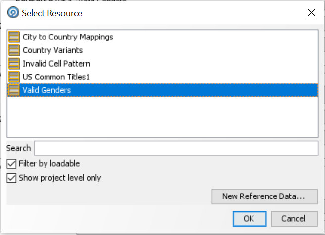

5.	Click “OK” to close the “List Check” dialog box.

6.	Double-click the “List Check” processor to rename it to “Check for Valid Gender”.

7.	Finally, click the “Run” icon to start the process and check the results.

    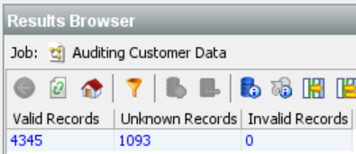

We now have a better understanding of our data and its issues. Next step is to create a process that will fix those issues.

You may now [proceed to the next lab](#next).

## Learn More
- [Oracle Enterprise Data Quality](https://docs.oracle.com/en/middleware/fusion-middleware/enterprise-data-quality/index.html)

## Acknowledgements
* **Author** - Ravi Lingam, Sri Vishnu Gullapalli, Data Integration Team, Oracle, August 2020
* **Contributors** - Meghana Banka, Rene Fontcha, Narayanan Ramakrishnan
* **Last Updated By/Date** - Rene Fontcha, LiveLabs Platform Lead, NA Technology, January 2021

