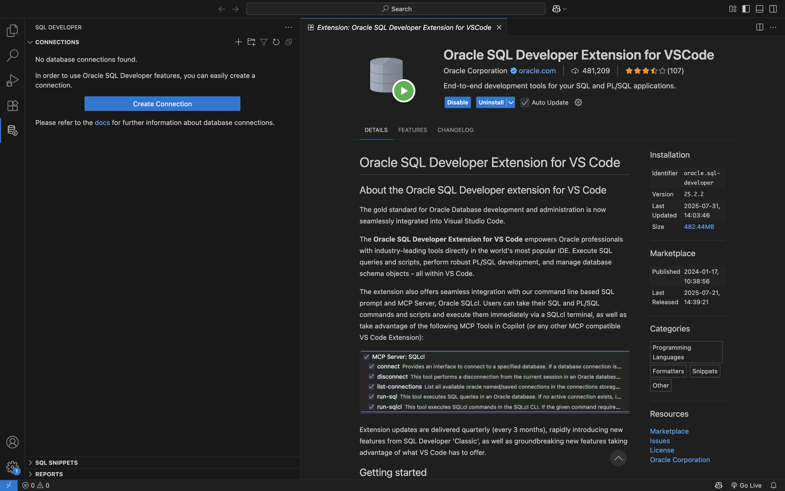
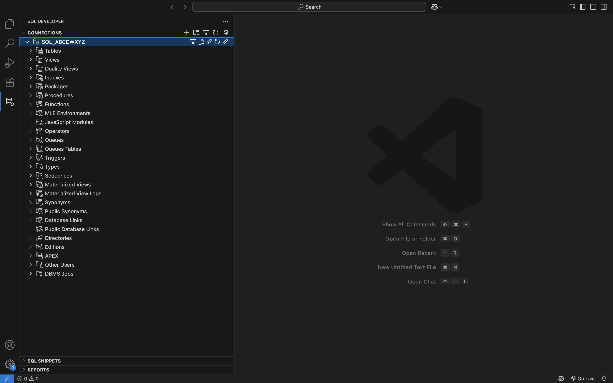
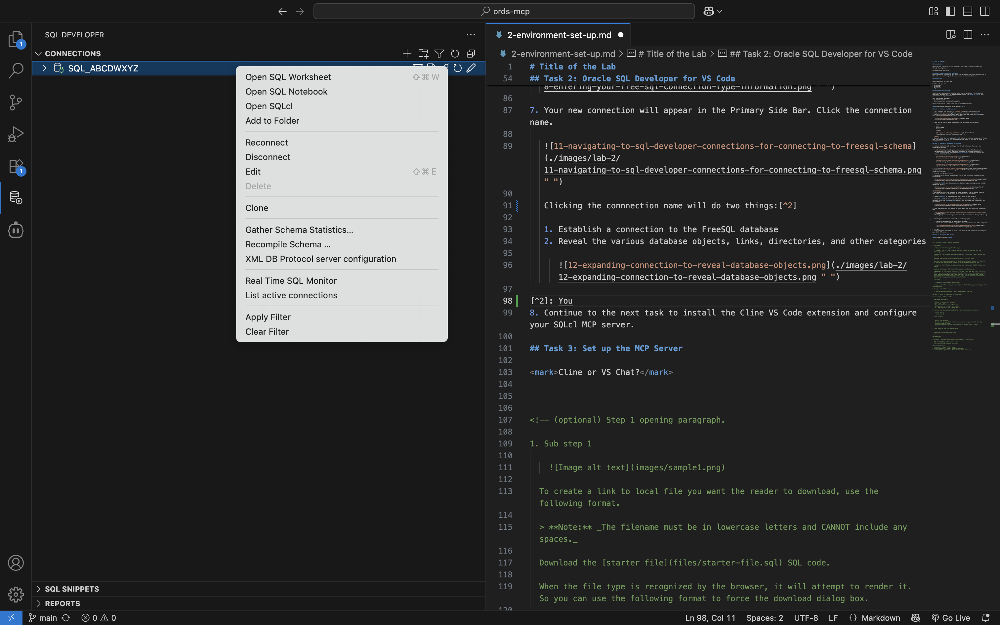

# Title of the Lab

## Introduction

*Describe the lab in one or two sentences, for example:* This lab walks you through the steps to ...

Estimated Time: n minutes

### About Product/Technology (Optional)
Enter background information here about the technology/feature or product used in this lab - no need to repeat what you covered in the introduction.

### Objectives

*List objectives for this lab*

In this lab, you will:
* Objective 1
* Objective 2
* Objective 3

### Prerequisites (Optional)

*List the prerequisites for this lab using the format below. Fill in whatever knowledge, accounts, etc. is needed to complete the lab. **Do NOT list** each previous lab as a prerequisite.*

This lab assumes you have:
* An Oracle account
* All previous labs successfully completed

*This is the "fold" - below items are collapsed by default*

<mark>Highlighting indicates To-Do/Pending</mark>

## Task 1: Create a FreeSQL account

1. In a separate tab, navigate to [freesql.com](https://www.freesql.com).
2. Sign in with your existing Oracle account, or create a new account. 
3. Log in to [freesql.com](https://www.freesql.com) and click the <kbd>Connect with [rotating language option]</kbd> button.

   

4. Take note of your FreeSQL credentials. You will need the following: 

   - Hostname
   - Port
   - Service Name
   - Username
   - Password

     

> [!NOTE]
> You must click the <kbd>Regenerate</kbd> button to create a new password. Please save this password, as it will only be displayed once. It will not be saved or displayed across sessions.

## Task 2: Oracle SQL Developer for VS Code

1. Install Oracle the SQL Develeoper for VS Code extension. There are two installation options:

   1. [Install](https://marketplace.visualstudio.com/items?itemName=Oracle.sql-developer) the latest Oracle SQL Developer for VS Code Extension.[^1]
   2. From within VS Code, navigate to **Extensions**, search for "Oracle" and choose <kbd>Install</kbd>

     

     

     

[^1]: Visit the [Setting up Visual Studio Code](https://code.visualstudio.com/docs/setup/setup-overview) reference page for available configuration options and features of VS Code.  

2. Restart your VS Code session
3. Navigate to the Oracle SQL Developer for VS Code extension (located in your Activity Bar)

   

4. Click the <kbd>Create Connection</kbd> button, begin entering in your FreeSQL connection details.

   

>[!IMPORTANT]
> Make sure you click the checkbox to "Save Password." The MCP server requires this saved password to establish a SQLcl connection on your behalf.

5. Choose **Basic** as the Connection Type, enter in your details. 

6. Click the <kbd>Test</kbd> button to test your connection. When the test succeeds, click the <kdb>Save</kbd> button. This will save your connection, but not connect.

   

7. Your new connection will appear in the Primary Side Bar. Click the connection name. 

   

   Clicking the connnection name will do two things:[^2]

   1. Establish a connection to the FreeSQL database
   2. Reveal the various database objects, links, directories, and other categories

      

[^2]: You can also right-click on a connection name to reveal the context menu. You can connect, disconnect, and edit connections as well as perform other common actions.<details><summary>Click for image</summary>

  

</details>

8. Continue to the next task to install the Cline VS Code extension and configure your SQLcl MCP server. 

## Task 3: Set up the MCP Server

<mark>Cline or VS Chat?</mark>


<!-- (optional) Step 1 opening paragraph.

1. Sub step 1

		

  To create a link to local file you want the reader to download, use the following format.

	> **Note:** _The filename must be in lowercase letters and CANNOT include any spaces._

  Download the [starter file](files/starter-file.sql) SQL code.

	When the file type is recognized by the browser, it will attempt to render it. So you can use the following format to force the download dialog box.

	> **Note:** _The filename must be in lowercase letters and CANNOT include any spaces._

	Download the [sample JSON code](files/sample.json?download=1).

  *IMPORTANT: do not include zip files, CSV, PDF, PSD, JAR, WAR, EAR, bin or exe files - you must have those objects stored somewhere else. We highly recommend using Oracle Cloud Object Store and creating a PAR URL instead. See [Using Pre-Authenticated Requests](https://docs.cloud.oracle.com/en-us/iaas/Content/Object/Tasks/usingpreauthenticatedrequests.htm)*

2. Sub step 2

    

4. Example with inline navigation icon  click **Navigation**.

5. Example with bold **text**.

  If you add another paragraph, add 3 spaces before the line.

## Task 2: <what is the action in this step>

1. Sub step 1 - tables sample

  Use tables sparingly:

  | Column 1 | Column 2 | Column 3 |
  | --- | --- | --- |
  | 1 | Some text or a link | More text  |
  | 2 |Some text or a link | More text |
  | 3 | Some text or a link | More text |

2. You can also include bulleted lists - make sure to indent 4 spaces:

    - List item 1
    - List item 2

3. Code examples

    ```
    Adding code examples
  	Indentation is important for the code example to appear inside the step
    Multiple lines of code
  	<copy>Enclose the text you want to copy in <copy></copy>.</copy>
    ```

4. Code examples that include variables

	```
  <copy>ssh -i <ssh-key-file></copy>
  ```

## Learn More

*(optional - include links to docs, white papers, blogs, etc)*

* [URL text 1](http://docs.oracle.com)
* [URL text 2](http://docs.oracle.com)

## Acknowledgements
* **Author** - <Name, Title, Group>
* **Contributors** -  <Name, Group> -- optional
* **Last Updated By/Date** - <Name, Group, Month Year> -->
