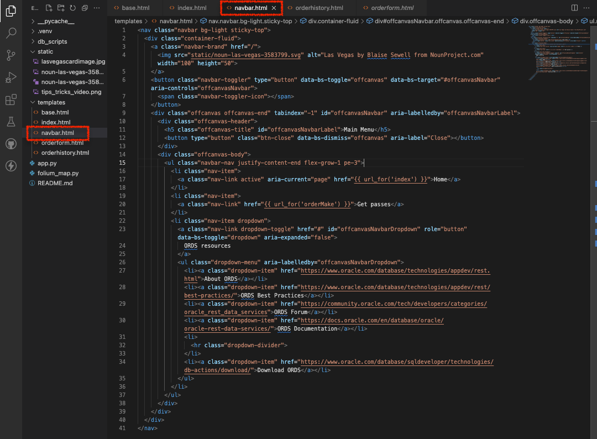
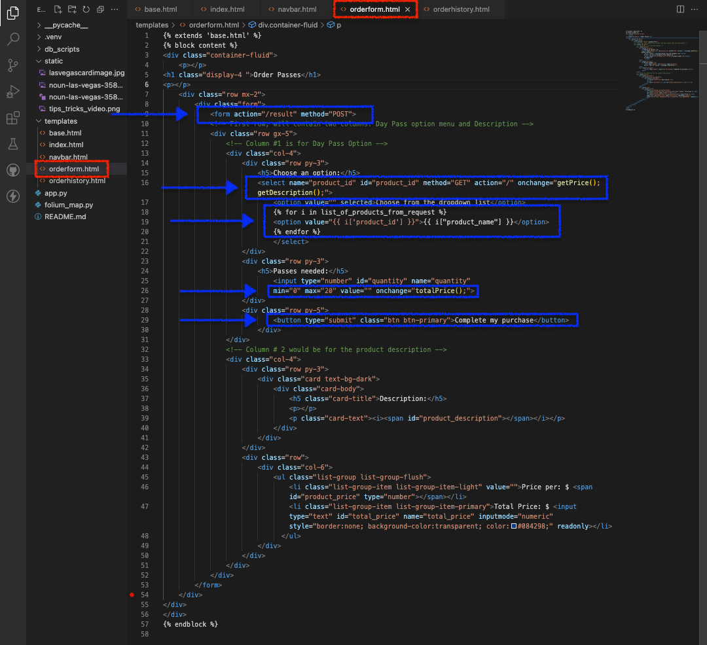

# Title of the Lab

## Introduction

In this lab we'll continue to review the technologies and frameworks used in this web application.

Estimated Time: 20 minutes

### About Oracle REST Data Services (ORDS) and developer tools 
This lab will discuss a variety of Enterprise and open source technologies, including: 
- Oracle REST Data Services (ORDS)
- Oracle Clould Infrastructure (OCI) <i>Always Free</i> Tier Tenancy
- Datbase Actions
<!-- I'm actually not sure about cURL, but I don't want to forget it -->
<!-- Make sure any changes here are also included in the Learn More section - we'll want to include those resources as well  -->
- cURL
- Python 3.10.x and later 
- Python packages (libraries) such as: 
  - Flask 
  - Folium 
  - Json
 - Requests 
- <i>select</i> JavaScript functions 
- Bootstrap HTML and CSS frameworks
- Microsoft Visual Studio Code 

We will discuss and explore these technologies and solutions in a practical sense. However, should you wish explore above what this workshop covers, we encourage you to refer to the "Learn More" section of this page. 

### Objectives
In this lab, you will review the applications's:
* HTML templates
* CSS
* JavaScript functions
* Review the API's paths and functions

### Prerequisites
This lab assumes you have:
* An Oracle Cloud Infrastructure account
* All previous labs successfully completed

<!-- *This is the "fold" - below items are collapsed by default* -->

## Task 1: Review the application module

1. Static and Template folders

	

	Collapse all folders to get a more focused view of the application and its dependencies. You'll notice a `static` and `template` folder. Typically, the `static` folder will contain any CSS or Javascript files. In this application, since we are using Bootstrap almost exclusively, we're largely removed the need for separate CSS files. Most of the HTML and CSS work is done through Bootstrap's APIs. You will however see images that are unique to our sample application. 

  The other, more comprehensive folder, is the `template` folder. Here you'll find all HTML pages used for this application. We'll also explore how we've integrated Bootstrap as well as JavaScript <i>directly</i> into our HTML pages. You'll see the `template` folder is simple. It includes all the HTML pages a user would interact with: 
  - `base.html`
  - `index.html` 
  - `navbar.html`
  - `orderform.html` 
  - `orderhistory.html` 

  We'll review the HTML pages in more detail next. 

## Task 2: Review the HTML pages

1. `base.html`

    

    The `base` HTML page is quite literally the base, foundation of this application. You'll notice we include an API for Bootstrap's CSS framework. At the bottom of this page, you'll see we include the API for JavaScript as well. This all allows us to easily extend the Bootstrap framework - which allows us to rely no Bootstrap for much of the presentation layer of this application. For if not, all HTML and CSS would need to be coded from scratch. 

    You'll also notice three JavScript functions: `totalPrice()`, `getPrice()`, and `getDescription()` These functions are triggered when a user visits and/or interacts with the `orderform.html` page. We'll discuss in more detail the output of each function shortly. 

    You may also notice Jinja templating near the `</head>`, and `<main>` HTML tags. The different variations (which you'll see throughout) are referred to as "delimiters":

    <!--  -->
    -  are used statements
    - {{ ... }} are used for Expressions
    - {# ... #}
    

    Each serve different purposes, but all allow us to easily and dynamically pass in additional information while using syntax similar to python. While Jinja education is outside the scope of this lab, you may review the **Learn More** section of this lab to review the Jinja documentation.

    We will rely on this `base.html` page across the application. We will also need the navigation bar across all pages, thus we include it so it will render in all pages (i.e. the `` placeholder).

    When we include an HTML page inside another, it will <i>always</i> render with the page. A parent-child relationship is established among `base.html` (parent) and `navbar.html` (child). Later on, we'll discuss the `navbar.html` page in more detail.

    We take a similar approach with the following placeholders:

    ` `

    Now, anywhere else in our HTML where we specify  "block content" it will render in the corresponding body section of the `base.html`. You'll also see later, that other pages will "extend" the `base.html` file; this will ensure that each page includes the properties of the `base.html` page (like our JavaScript functions, and Bootstrap's HTML and CSS). But to the user, they will still remain on the page of focus, as we'll see in the `index.html` page.

2. `navbar.html` 

    

    Before we review the `index.html` page, we'll briefly review the `navbar.html` page.  Rather than having to create this navbar from scratch, we borrow extensively from the Bootstrap framework. In fact, much of this navbar remains largely unchanged from the original Bootstrap example (except for the links we've provided, and small design adjustments). <i>Look familiar?</i>

    

3. `index.html` 

    

    This page acts as the "landing page" for the user. When the user is first welcomed, there is copy related to the product/service. Notice the Jinja here as well. Recall how "block content" works in concert with the `base.html` page. The HTML on this `index.html` page will "extend" the `base` page (i.e. ``), while still displaying the `index.html` page. And since the `navbar` is included in the `base` page, it will display here as well.

    Further down, you will see `{{ lvmap | safe }}`, this allows us to pass in the Folium map (which was created in our `app.py` file). We use the "safe" filter to indicate that this should <i>not</i> be escaped, should there be a case where automatic escaping is enabled. Otherwise, we run the risk of our map not rendering. 

    Finally, you'll see a button (surrounded by the blue box), which when clicked, will take the user to the `orderform.html` page.

    <!--  -->

4. `orderform.html`

    

    If you recall, the index page (after clicking the "Purchase Day Passes" button) takes the user to this order form page. Here we see the `base.html` page is extended and we see similar Jinja formatting. We also see several new additions to this HTML page.

    #### Selected actions on the `orderform.html` page:

      1. 
      
          Here you will notice, that once the form is submitted, `@app.route('result')` is triggered. Recall on the `app.py` file that this route accepts both `POST` and `GET` methods (aka "requests"). The function included in `@app.route('result')`, has an ORDS endpoint, which expects a json payload. After receiving this `POST` request, the related table will be updated to include a customer's order information.

      2.  
      
          Here you'll see `method="GET"` and `action="/"`, which means, when a change is encountered in the dropdown list of products the application will perform a `GET` request and return the results to this page (signified by `"/"` in the `action` portion of the HTML). 
          
          The two JavaScript functions `getPrice()` and `getDescription` can be found on the `base.html` file. But if you recall, each of these functions is associated with two separate Python functions located in the `app.py`file. As a user selects a product, one function will retrieve the unit price of a product, the other will retrieve the description of a product.
          
          The results of each are placed in the HTML document according to their Element IDs: `id="product_description"` and `id="product_price"`. We use `` to include the contents of these `GET` requests directly into the body of the HTML.
      
      3. 

          Here you'll see a list we populated from the results of a `GET` request in our `@app.route('/orderform')` route. We pass and iterate though the list to populate the contents of this dropdown field. And as different products are selected, this triggers the `onchange=""` event in the previous sequence. 
      
      4. 

          Yet again, see a JavaScript function. Although this time, no API requests are required. This function calculates the total cost of the purchase based off the quantity and product type selected.
      
      5. 

          If you recall, the submit button acts as the `form action` we highlighted in the first sequence of this HTML page. Once a user submits their purchase, all information is then sent as a JSON payload to an "Order History" table in our Oracle Autonomous Database. This is accomplished with the assistance of another ORDS endpoint; one that accepts incoming `POST` requests from the application.

5. `orderhistory.html`

  

  Once a purchase is made, a user will be directed to a page consisting of their order history. Of course, in an actual web application, there will be a payment gateway step. This is outside the scope of this workshop. However, should you choose to learn more, Stripe has extensive documentation on how this can be achieved in a Flask application. Refer to the "Learn More" section of this lab for details. 

  :bulb: <i>Note: Since you're sharing these endpoints, you may see orders from participants; that is to be expected.</i>

### You may now proceed to the [next Lab](#next).

## Learn More

*(optional - include links to docs, white papers, blogs, etc)*

* [Flask and Stripe](https://stripe.com/docs/legacy-checkout/flask)
<!-- * [About Database Actions](https://docs.oracle.com/en/database/oracle/sql-developer-web/)
* [About cURL](https://curl.se/)
* [About Python](https://www.python.org/)
* [About Flask for Python](https://flask.palletsprojects.com/en/2.1.x/)
* [About Folium for Python](https://github.com/python-visualization/folium)
* [About Json for Python ](https://docs.python.org/3/library/json.html)
* [About Requests for Python](https://requests.readthedocs.io/en/latest/)
* [About Bootstrap](https://getbootstrap.com/docs/5.2/getting-started/introduction/)
* [Mozilla Developer Network (MDN) Web Docs](https://developer.mozilla.org/en-US/) -->

Oracle REST Data Services (ORDS)
Oracle Clould Infrastructure (OCI) <i>Always Free</i> Tier Tenancy
Datbase Actions
<!-- I'm actually not sure about cURL, but I don't want to forget it -->
<!-- Make sure any changes here are also included in the Learn More section - we'll want to include those resources as well  -->
- cURL
- Python 3.10.x and later 
- Python packages (libraries) such as: 
  - Flask 
  - Folium 
  - Json
 - Requests 
- <i>select</i>JavaScript functions 
- Bootstrap HTML and CSS frameworks

## Acknowledgements
* **Author** - Chris Hoina, Senior Product Manager, Database Tools
* **Contributors**
  - Jeff Smith, Distuinguished Product Manager, Database Tools
  - Justin Biard, Senior Member of Technical Staff, Database Tools 
  - Zachary Talke, Product Manager, Database Tools
  - Brian Spendolini, Principal Product Manager
* **Last Updated By/Date** - Chris Hoina, August 2022, 