# Lab 2: Oracle REST API *deeper* dive

## Introduction

In the previous Lab you were first introduced to our sample Flask application, and its basic functions. You also learned *superficially*, about some of the capabilities of Oracle REST APIs. 

As a developer, you may have some experience with APIs and API development. You may have even tested APIs in tools like Postman, or in a Swagger editor. In this Lab we'll continue our exploration of Oracle REST APIs, using the browser-based OpenAPI Swagger editor. 

Estimated Time: 20 minutes

### Objectives

In this lab, you will:
- Inspect and interact with the provided Oracle REST APIs
- Review available Paths and HTTPS Operations
- Review OpenAPI documentation 

### Prerequisites

This Lab assumes you have:
- All previous Labs successfully completed

## Task 1: Navigate to the Swagger Editor

For this lab we'll rely on Swagger's Open Source Editor to review our ORDS Base URI, as well as the available API *Paths* and *Operations*.

> :bulb: You may skip straight to the [Swagger Editor](https://editor.swagger.io/), or follow along below.

1. Navigate to the [Swagger home page](https://swagger.io/) and select the **Swagger Editor** link (located under the **Tools** dropdown).

    

2. Next, select **Live Demo** - a blank Swagger Editor session should load.

    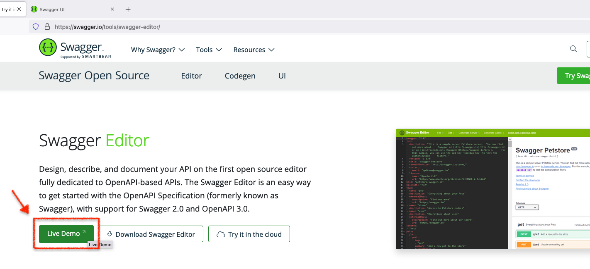

3. If a new Editor session page does not appear, navigate to the **`File`** menu option, and select **`Clear Editor`**. A new blank session should then appear.

    

4. Copy the following ORDS Base URI: 

    ```
    <copy>https://yfuxkbz2ls7taze-ordshandsonlabs.adb.us-phoenix-1.oraclecloudapps.com/ords/python/open-api-catalog/flask/
    </copy>
    ```

5. Navigate to **`File`** then **`Import URL`**.

 

6. Paste the URI into the input field, and click **`OK`**.

    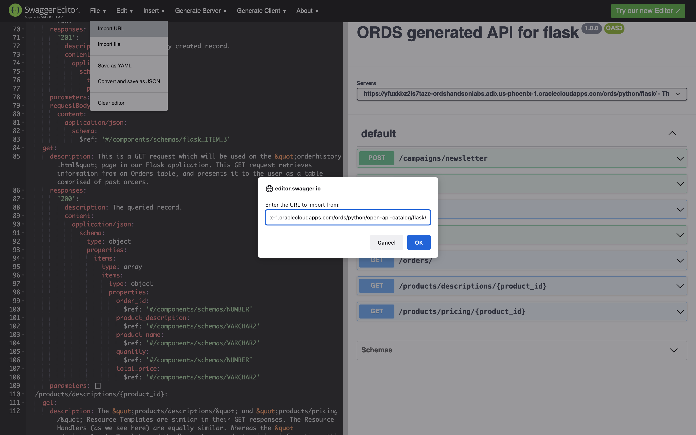

7. Locate the Swagger documentation - available Paths and their Operations.

  Once loaded, Swagger documentation will appear on the left of your browser. Additionally a list of the available ORDS Paths and their Operations are located on the right of your screen. These Paths and Operations are the heart and soul of our Flask application.

      

## Task 2: Review the OpenAPI 3.0 definitions

1. Collapse the Swagger documentation tree:

    

2. Next we'll briefly review the tree.

    1. **`openapi`** - this particular ORDS API adheres to the OpenAPI 3.0 specification for API documentation (as seen below). 

      

        > :brain: To learn more about OpenAPI specifications, you may refer to the resources provided in the "Learn More" section of this lab.

    2. **`info`** - here you'll see the **`title`** and **`version`** of the ORDS *Base URI*.

      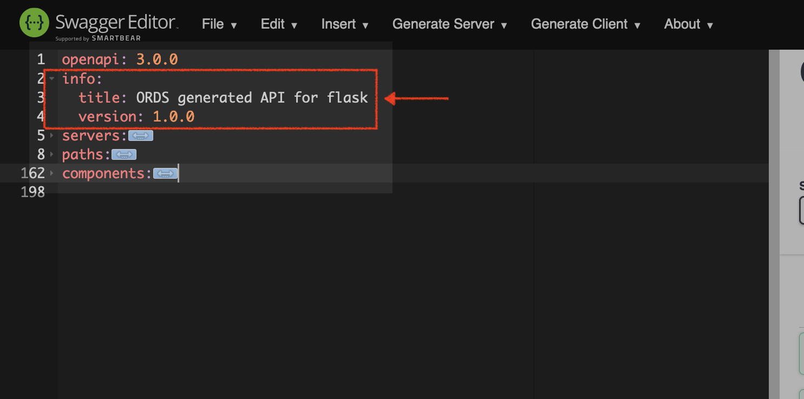

    3. **`servers`** - the actual Base URI for this ORDS API. All Paths and parameters will be added to this existing **U**niversal **R**esource **I**dentifier (URI), referred to as a **URL** here.

      

    4. **`paths`** - a list of our available *Paths*: 

      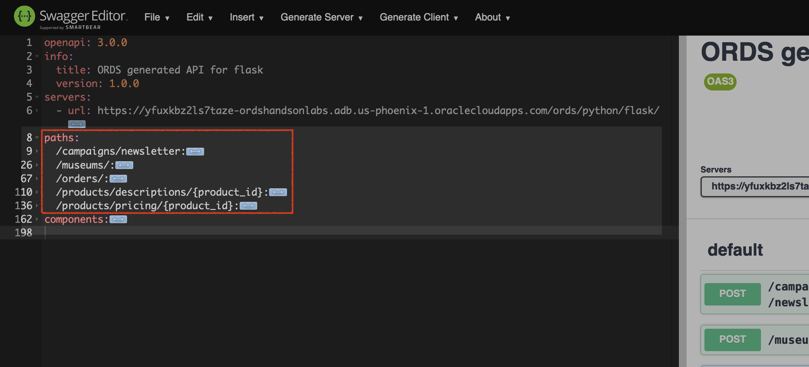

      Expand the **`/orders/`** Path. You should notice that we've designed this Path to accept both **`GET`** and **`POST`** requests.

      

      Review the **`GET`** Method; you should see all the properties.

      

    5. **`components`** - otherwise considered *globally-defined* parameters that may be shared across the various Paths and their HTTPS Operations.

      

## Task 3: Explore ORDS Templates and Handlers

1. **Locate the Paths**. Under the "default" section of the browser (on the right side of your browser window), you'll find the *Paths*.

    
    
   > :bulb: *You may refer to the "Learn More" section of this Lab to learn more about Resource Templates and their relationship to Resource Handlers.*

2. **Explore the Paths**. Here we'll review selected Paths and discuss their importance to the Flask application.

    1. **`GET` `/museums/`**

        1. Hover over this Path, a dropdown arrow will appear. Click this to expand the window.

            > :brain: *You'll follow similar actions for subsequent Paths.*

            

        2. Click **Try it out**.

          

        3. The **Execute** button will appear, click it to issue a **`GET`** request.

          

        4. Scroll down to the **Response Body** of the **`GET`** request.

          
          
          > :question: *What does this payload look like it could be used for?* If you guessed a map rendering, than you'd be correct! We use this information to populate the Folium map on our Flask application's main page (aka **`index.html`**).

    2. **`GET` `/products/descriptions/{product_id}`**

          1. Expand the Path's window and click **Try it out**. Notice the input field for an Implicit Parameter (we'll be updating this shortly).

              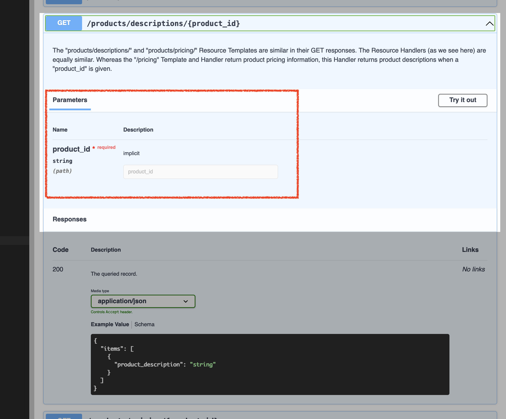

          2. Your Flask application has three different products, each with their own Product ID (i.e. **`product_id`**). To test this Path, we'll input the number **`1`** and click **`Execute`**.

              

          3. Notice how the Request URL (the first red box in the image below) has changed slightly, to include the **`product_id`**. Next, we'll review the Server response. 

             - You'll see this **`product_description`** (the second red box in the image below) appear on the ordering/purchasing page of our Flask application. As the user makes a product selection a separate API call is executed to display a product description.

               

             - A similar Path has been created for **`GET` `/products/pricing/{product_id}`**. But instead of a product description, the unit price for a product is returned.

               

    3. **`POST` `/orders/`**

        Next we'll review the **`/orders/`** Path. Recall this Path has both a **`GET`** and a **`POST`** request. We'll review the **`POST`** request for this example.
        
        1. Expand the window and click **Try it out**. Notice the Example Value - Schema; how a JSON object is structured when a **`POST`** request is sent.

            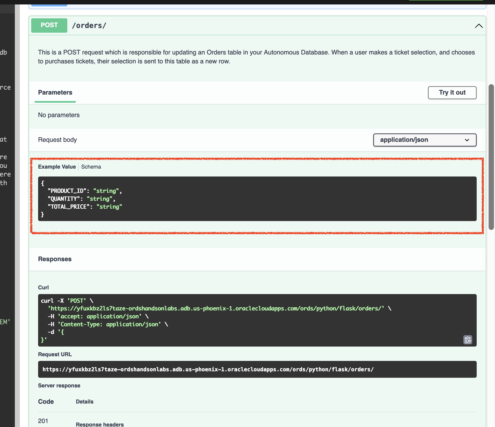

        2. After clicking **Try it out**, the Request body will expand, you'll see a placeholder array.
        
           

        3. Alter the values slightly. Choose:
          - 1, 2 or 3 for **`PRODUCT_ID`** value
          - between 1-100 for **`QUANTITY`** value
          - between 1.00-500.00 for **`TOTAL_PRICE`** value

        > :pencil2: Choose an *easily recognizable* **`TOTAL_PRICE`*** value. 
          
        4. Once you are satisfied click **`Execute`**.
          
          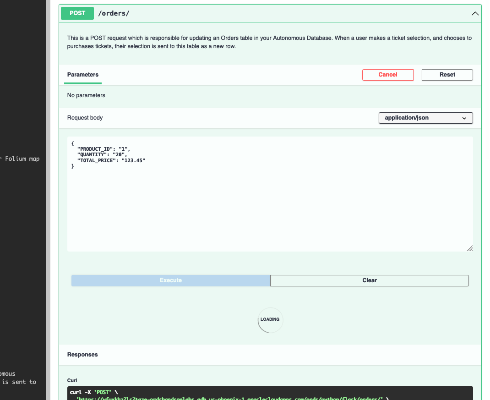
        
        5. Scroll down to the Response body. You should see a **`201`** Server Response code, which indicates that your **`POST`** was successful!

            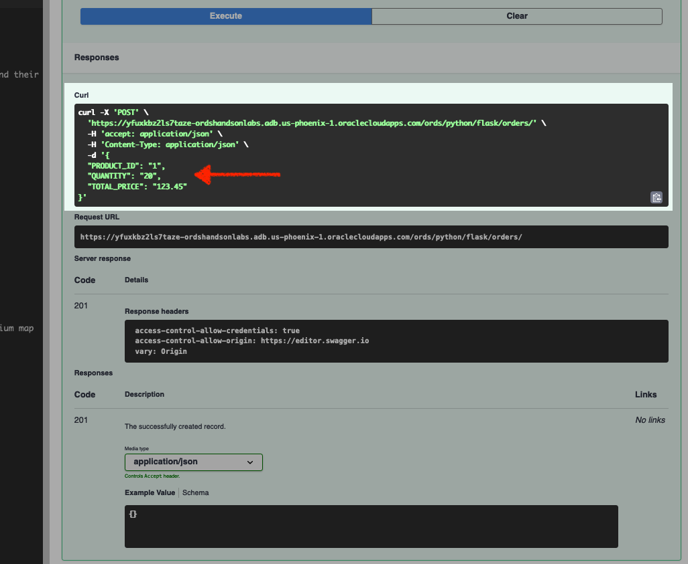
          
          > :pirate_flag: The action we just performed mirrors what customer would do should they complete a transaction in our sample Flask application.

        6. Let's find your **`POST`** by performing a **`GET`** request on **`/orders/`**. Expand the **`GET /orders/`** window.

          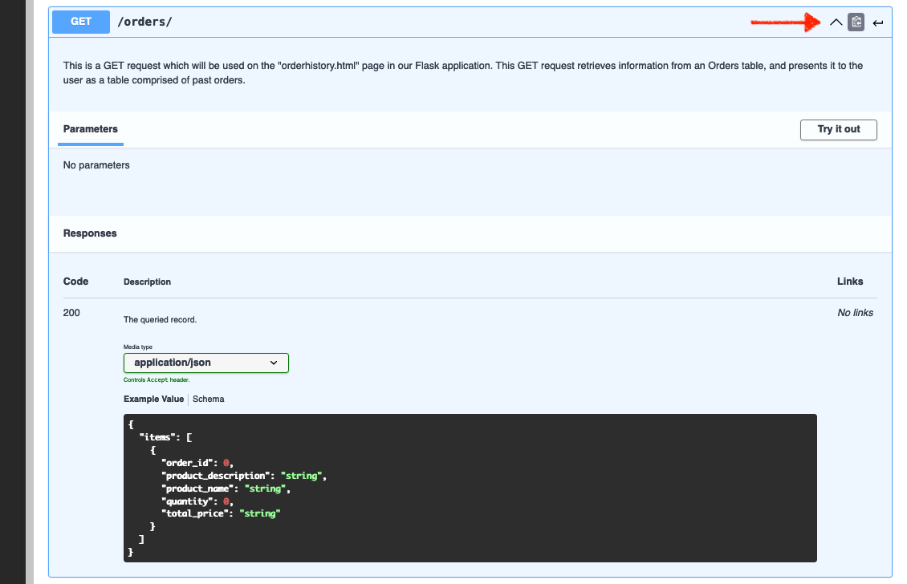

        7. Click **Try it out** followed by **Execute**.

          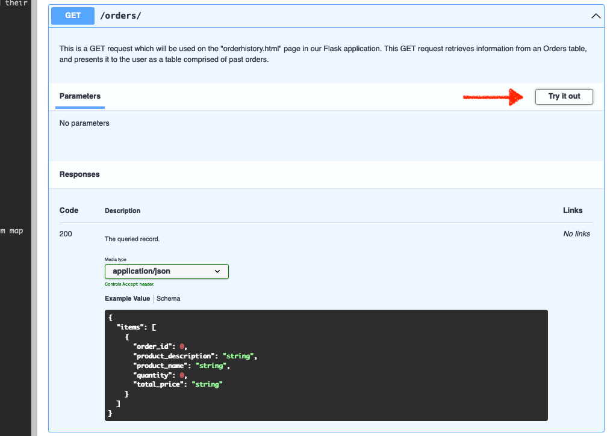
          <sub>*Clicking **Try it out** followed by **Execute**.*</sub>
          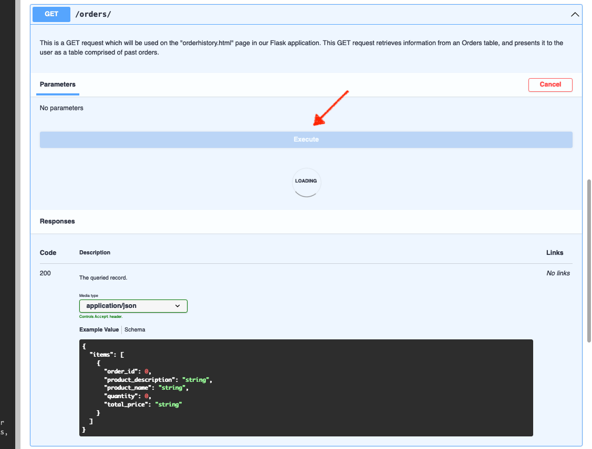

        8. Once the request completes, scroll down to the Response Body and locate your new entry. 

          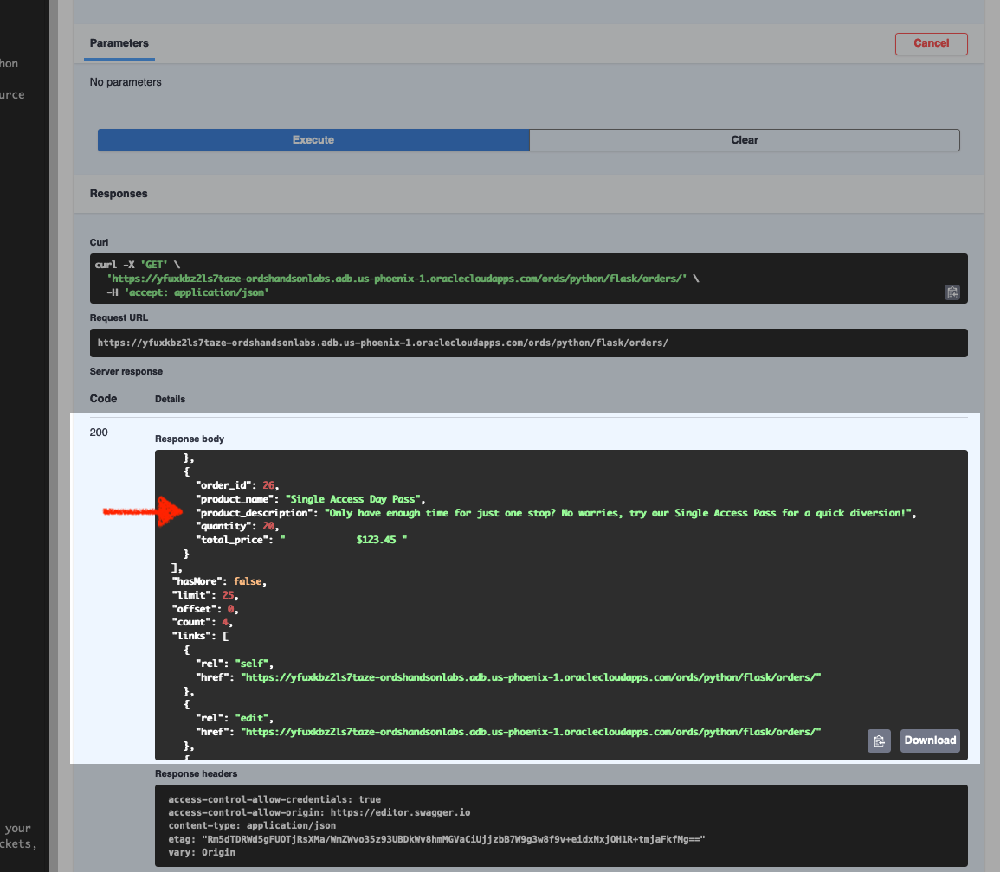

        9. You can also download a **`JSON`** file and review directly in your editor too!

          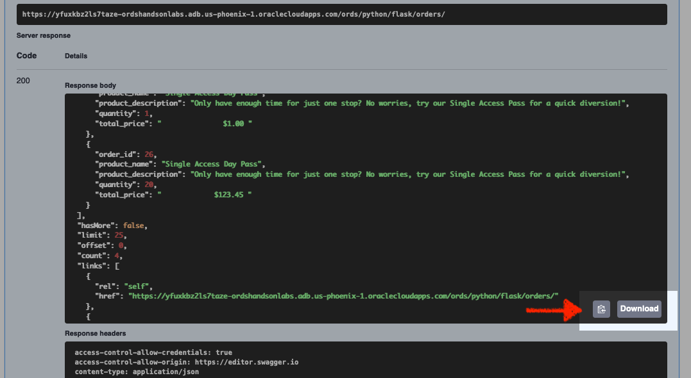
          <sub>*Reviewing a `JSON` document in VS Code.*</sub>
          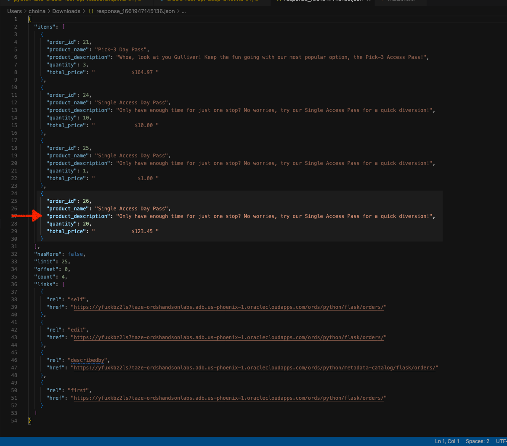   

4. Congratulations! You should now have a better understanding of how our Oracle REST APIs are structured as well as the role they play in this sample Flask application. 
    
      - In the next Lab we'll review our Python file (**`app.py`**) and review routing, functions, and how they interact with these same Oracle REST APIs.  
        
### You may now proceed to the [next Lab](#next).

## Learn More

- [About ORDS](https://www.oracle.com/database/technologies/appdev/rest.html)
- [About OpenAPI Specifications](https://swagger.io/docs/specification/basic-structure/)
- [About ORDS Resource Templates and Handlers](https://docs.oracle.com/en/database/oracle/oracle-rest-data-services/22.2/orddg/developing-REST-applications.html#GUID-50E24524-32BB-470D-8015-6C25C9B47A44)
- [About Folium](http://python-visualization.github.io/folium/)
- [About Leaflet.js](https://leafletjs.com/)

## Acknowledgements

* **Author** - Chris Hoina, Senior Product Manager, Database Tools
- **Contributors**
  - Jeff Smith, Distuinguished Product Manager, Database Tools
  - Zachary Talke, Product Manager, Database Tools
  - Brian Spendolini, Principal Product Manager
- **Last Updated By/Date** - Chris Hoina, August 2022
