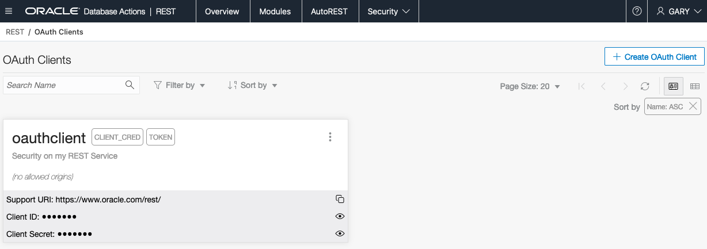
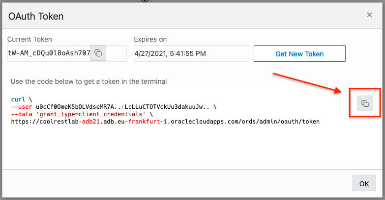

# Securing Oracle REST APIs

## Introduction

You may have noticed in the previous Labs, none of our Oracle REST APIs required a Bearer Token. And that is because, our goal was to introduce you to the concept of a Flask application <i>plus</i> Oracle REST APIs.

However, as security is of high importance, we suggest you complete our separate Workshop <b>How to build powerful, secure REST APIs for your Oracle Database</b>. 

- OAuth 2.0 workflow for authentication. 
- Quick note on security
- Snippet of python for call for access token 

Where we can establish Roles:

And Privileges for those roles: 

 

And even create an OAuth Client for securing our Oracle REST Endpoints:

At which point we could obtain a Bearer Token:

Which can be used to authenticate a user, as seen in this sample cURL command: 

You may visit the Modern Application Development with Oracle REST Data Services Workshop [here](https://apexapps.oracle.com/pls/apex/dbpm/r/livelabs/view-workshop?wid=815). Our, in the <b>Other LiveLabs you might like</b> section of this Workshop.

There you will complete objectives such as:
  - Create an Autonomous Database
  - Connect to your Autonomous Database using Database Actions/SQL Developer Web
  - Create and Auto-REST enable a table
  - Load data into the database
  - Publish RESTful services for various database objects
  - Secure the REST endpoints

Congratulations, you have successfully completed this Workshop!

### You may now proceed to the [next Section](#next).

## Learn More

* [About ORDS](https://www.oracle.com/database/technologies/appdev/rest.html)
* [ORDS Best Practices](https://www.oracle.com/database/technologies/appdev/rest/best-practices/)
* [ORDS, SODA & JSON Developer Forum](https://community.oracle.com/tech/developers/categories/oracle_rest_data_services) 

## Acknowledgements

* **Author** - Chris Hoina, Senior Product Manager, Database Tools
* **Contributors**
  - Jeff Smith, Distinguished Product Manager, Database Tools
  - Zachary Talke, Product Manager, Database Tools
  - Brian Spendolini, Principal Product Manager
* **Last Updated By/Date** - Chris Hoina, August 2022
