# How to build powerful, secure REST APIs for your Oracle Database - REST Enable Business Logic and Custom SQL

## Introduction

In this lab, you will use Database Actions and the REST console to build a REST API using a parametrized PL/SQL procedure and SQL statement. 

Estimated Lab Time: 20 minutes

Watch the video below for a quick walk through of the lab.

[](youtube:6Y_BArzNgaw)

### You can learn more about REST in the  **Learn More About REST** section the [introduction](https://github.com/oracle-livelabs/developer/blob/main/rest-services-for-adb-appdevlive/intro/intro.md) page of this lab.

### Objectives

- Publish REST API using Custom SQL
- Publish REST API using stored PL/SQL procedure
- Explore the OpenAPI View created by ORDS


### Prerequisites

- The following lab requires an <a href="https://www.oracle.com/cloud/free/" target="\_blank">Oracle Cloud account</a>. You may use your own cloud account, a cloud account that you obtained through a trial, or a training account whose details were given to you by an Oracle instructor.

This lab assumes you have completed the following:
* Login to OCI: [Login to Oracle Cloud](https://github.com/oracle-livelabs/common/blob/main/labs/cloud-login/pre-register-free-tier-account.md)
* Lab 1: [Provision an Autonomous Database](https://github.com/oracle-livelabs/database/blob/main/db-quickstart/db-provision/db-provision.md)
* Lab 2: [Connect to your Autonomous Database using Database Actions/SQL Developer Web](https://oracle-livelabs.github.io/common/labs/sqldevweb-login/sqldevweb-login.md)
* Lab 3: [Create and auto-REST enable a table](../create-table/create-table.md)
* Lab 4: [Loading Data and Creating Business Objects](../load-data-and-biz-objs/load-data-and-biz-objs.md)

## Task 1: REST Enable a custom SQL Statement

**If this is your first time accessing the REST Workshop, you will be presented with a guided tour. Complete the tour or click the X in any tour popup window to quit the tour.**

1. Start by using the **Database Actions Menu** in the upper left of the page and select **REST**

    

2. Once on the **REST page**, use the upper tab bar to select **Modules**

    

3. On the Modules page, left click the **+ Create Module** button in the upper right.

    

4. The **Create Module** slider comes out from the right of the page.

    

5. Using the **Create Module** slider, we start with the Module name. Lets use the following value of **com.oracle.livelab.api**

    ````
    <copy>com.oracle.livelab.api</copy>
    ````
    **A module is an organizational unit used to group related resource templates. Templates will have handlers, which are responsible for providing the logic required to service a specific HTTP method (e.g., GET, POST, PUT, DELETE, UPDATE, etc.)**


     

6. For the **Base Path** field, we can use the default of **/api/**. Enter **/api/** in the **base path field**.

    ````
    <copy>/api/</copy>
    ````

    

    Also select **Not Protected** with the **Protected By Privilege** select list.

    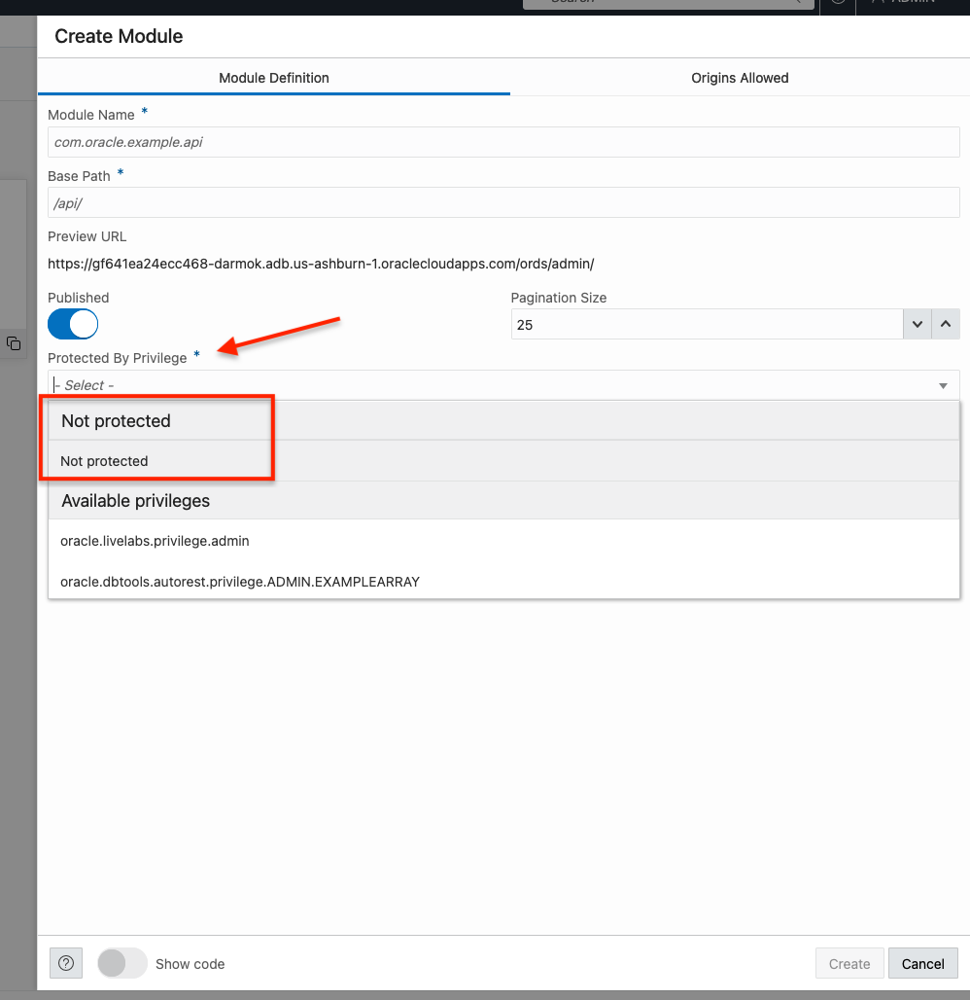

7. When the **Create Module** slider looks like the below image (**NOTE: your URL hostname will be different than the below image**), left click the **Create** button.

    

    **Here you can toggle "Show Code" to review what module creation might look like if it was performed manually.**

    

8. Our module has now been created.

     

    Next we'll create a **Template** for our newly created module. Start by left clicking the **+ Create Template** button on the right side of the page, located directly under the module we just created.

    

9. The **Create Template** slider emerges from the right of the page. 

    
    
    Here we will create the endpoint, or URL location, for our REST enabled SQL Statement. This statement will expect a value.

10. In the **URI Template** template field, enter **sqlreport/:id**

    ````
    <copy>sqlreport/:id</copy>
    ````

    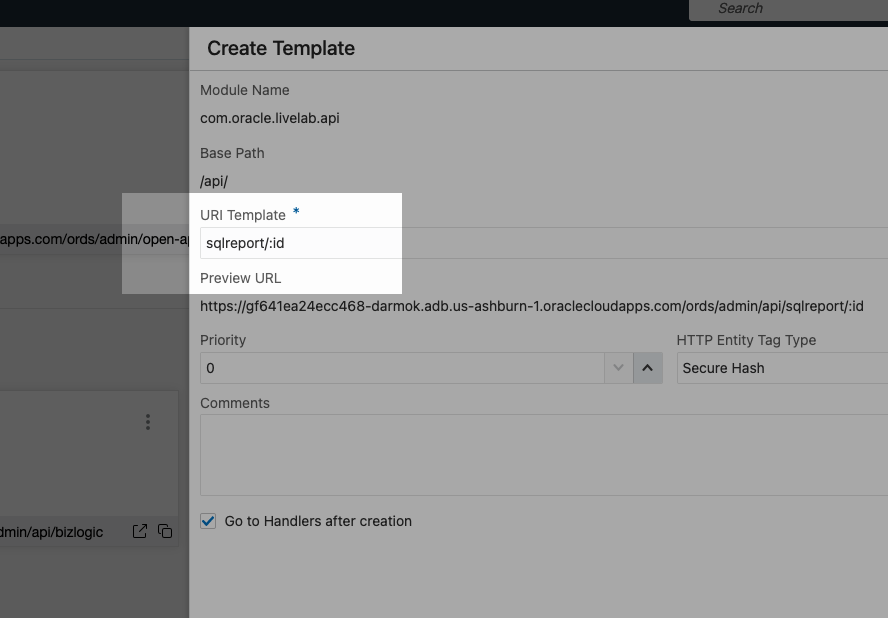

11. When the **URI Template** slider looks like the below image (**NOTE: your URL hostname will be different than the below image**), left click the **Create** button.

    

    **Toggle "Show Code" to review what template creation might look like if it was performed manually.**

    


12. Now that the template has been created

    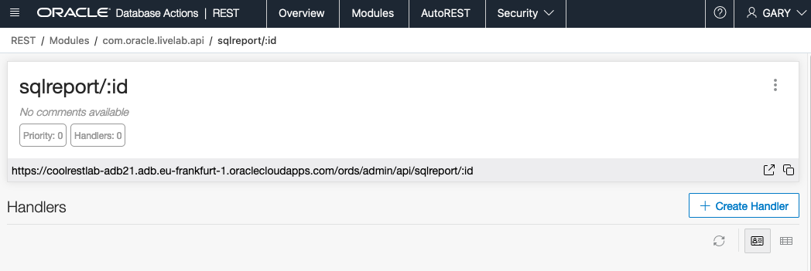

    we need to create the **Handler** that will contain the SQL Statement. Click the **+ Create Handler** button on the right of the page, just below our newly created template.

    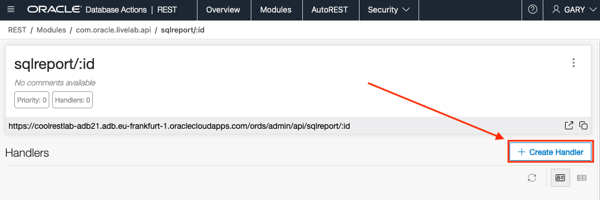

13. The **Create Handler** slider comes out of the right of the page. 

    

    Here we will enter the SQL used by our REST endpoint.

14. Enter **select * from csv_data where col2 = :id** in the **Source** section of the **Create Handler** slider:

    ````
    <copy>select * from csv_data where col2 = :id</copy>
    ````

    

    **Toggle "Show Code" to review the code for fields in the GUI.**

    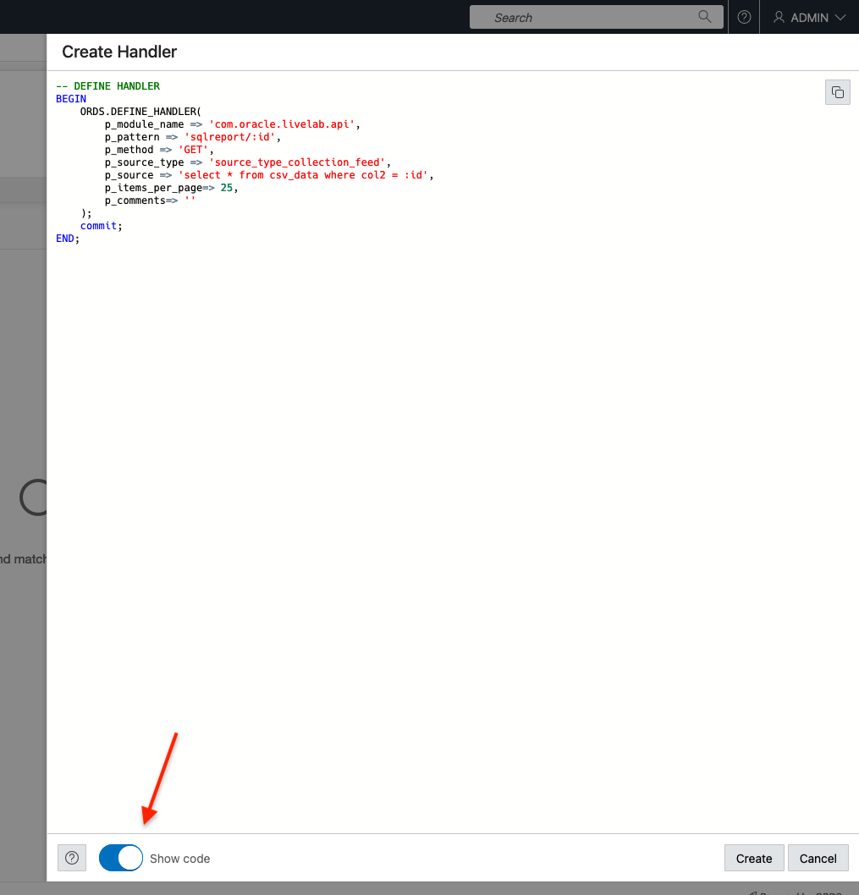

15. When the **Create Handler** slider looks like the below image (**NOTE: your URL hostname will be different than the below image**), left click the **Create** button.

    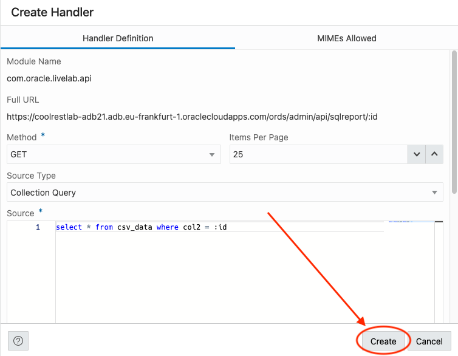

16. Back on Template page, we can test our handler. Click the **execute** button  in the **Source** section of the page.

    

17. After clicking the **execute** button , a **Bind Variables** modal will appear. Enter **a1** for the value in **id field** and then left click **OK** on the modal.

    

18. You can see the results of the query just below the **Source** section. (You may need to scroll the page down)

    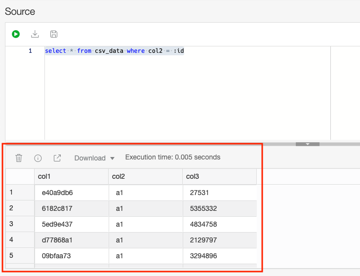

19. We can try the REST endpoint by clicking the pop out icon  in the Template region on the top of the page.

    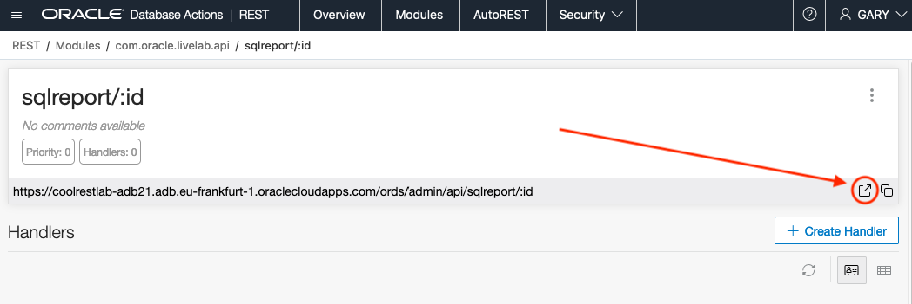

20. In the new browser tab/window with the REST endpoint URL

    

    replace the :id with a1 and submit the URL

    

## Task 2: REST Enable Business Logic (PL/SQL procedure)

1. It's now time to REST enable our Business Logic, or PL/SQL procedure, we created in the previous lab. Start by left clicking our module com.oracle.livelab.api in the Database Actions breadcrumbs in the upper left of the page.

    

2. Like before, we'll create a new **Template**. Left click the **+ Create Template** button on the right side of the page, right under our module.

    

3. The **Create Template** slider comes out of the right of the page. 

    
    
4. In the **URI Template** template field, enter bizlogic

    ````
    <copy>bizlogic</copy>
    ````

    

5. When the **URI Template** slider looks like the below image (**NOTE: your URL hostname will be different than the below image**), left click the **Create** button.

    

6. Click the **+ Create Handler** button on the right of the page, located below our newly created template just as we did before.

    

7. The **Create Handler** slider comes out of the right of the page. 

    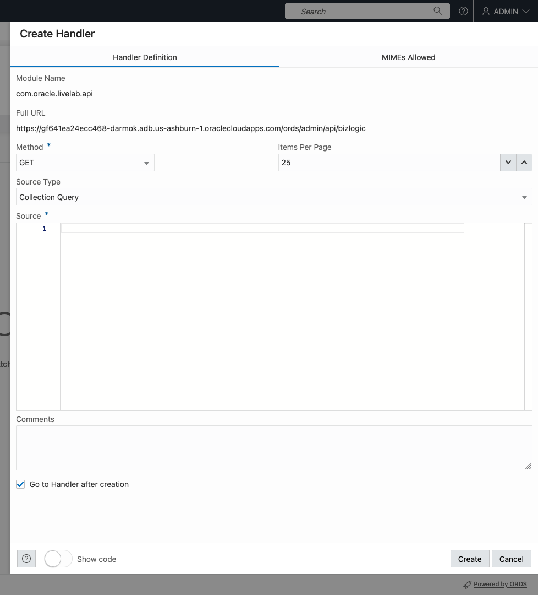

8. We need to change the **Method** from GET to POST because we are submitting a value to the REST Service. Use the dropdown in the **Method** field to select **POST**.

    

    Upon changing the **Method** to post, we see the **Source Type** change to PL/SQL.

9. Now, in the **Source** field, enter the following PL/SQL

    ````
    <copy>
    BEGIN
        return_count(p_input => :id, p_output => :output);
    end;
    </copy>
    ````

    

10. When the **Create Handler** slider looks like the below image (**NOTE: your URL hostname will be different than the below image**), left click the **Create** button.

    

11. Next step we need to create an output parameter so we can return the result; the count or rows where the passed in value is equal to the values in col2 in our table. On the bottom on the bizlogic details page, under the **Source** area, we see the **+ Create Parameter** button. Left click the **+ Create Parameter** button.

    

12. The **Create Parameter** slider emerges from the right of the page. 

    

13. For the **Parameter Name** field and the **Bind Variable Name** field, enter **output**

    ````
    <copy>output</copy>
    ````

    

14. For the **Source Type** field, use the dropdown and select **Response**

    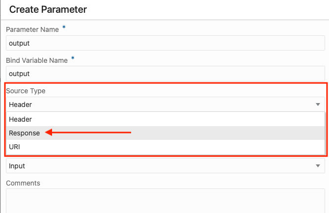

15. For the **Parameter Type** field, use the dropdown and select **INT**. (Remember, we are returning a number)

    

16. Lastly, for the **Access Method**, use the dropdown and select **Output**

    

17. When the **Create Parameter** slider looks like the below image (**NOTE: your URL hostname will be different than the below image**), left click the **Create** button.

    

18. You will see the newly created parameter in the parameters table on the bottom of the page.

    

    We are now ready to test this REST API.

19. Left click **bizlogic** in the Database Actions breadcrumbs in the upper left of the page.

    

20. Now, using the popout menu icon  on our **bizlogic POST tile**, select **Get cURL command**.

    

21. The cURL Command modal pops up.

    

    **Remember to select the appropriate cURL command for your environment**

    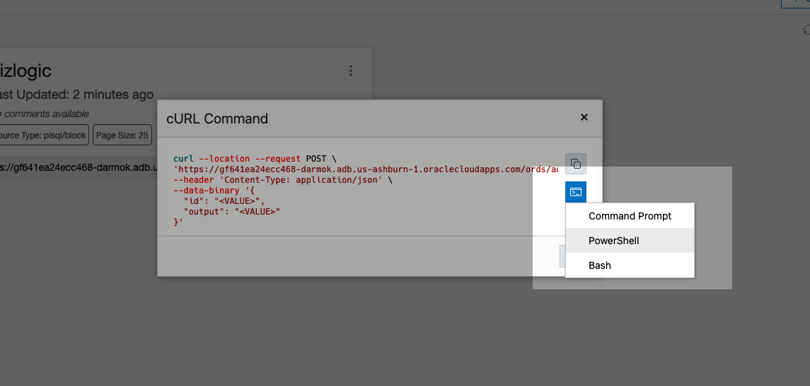

    Click the `Substitutions` icon, a modal will appear.

    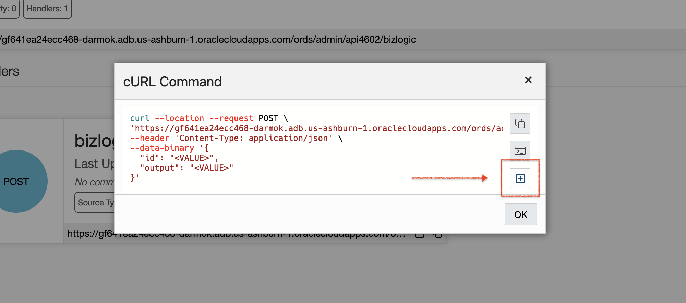
    
    Enter `a1` into the **id** field, and place a :heavy_check_mark: in the `Null` option for the `Output` field. Then click OK when done.

    

22. Click the copy icon to copy the cURL command with the added Substitution value.

    

23. Then, using the Oracle Cloud Infrastructure Cloud Shell, paste and run the cURL command to confirm that the count is returned as the output variable.

    ```
    <copy>curl -X POST \
    'https://coolrestlab-adb21.adb.eu-frankfurt-1.oraclecloudapps.com/ords/admin/api/bizlogic' \
    --header 'Content-Type: application/json' \
    --data-binary '{
    "id": "a1",
    "output": "" 
    }'</copy>                                                                
    ```

    

    You can test other values by changing the id variable. Valid combinations are those with a lowercase first character of **a** through **f** and second character of **1** though **9**. Valid examples are a1, e9, d3, b6, etc.

## Task 3: Explore the OpenAPI View created by ORDS

1. Return to the Module's main page. This can be done by clicking the module's name in the breadcrumbs in the upper left of the page.

    

2. Click the the pop out icon  in the Module region and select **OpenAPI View**.

    

3. The OpenAPI View page displays your REST services as a Swagger UI implementation.

    

    You can explore the APIs you created and try them out right there in the page.
    
    

    You can also export this page as an OpenAPI doc for use in other tools and services using the pop out icon.  Select **Export Module** then **OpenAPI**.

    

    **An example of what the OpenAPI export will look like.**

    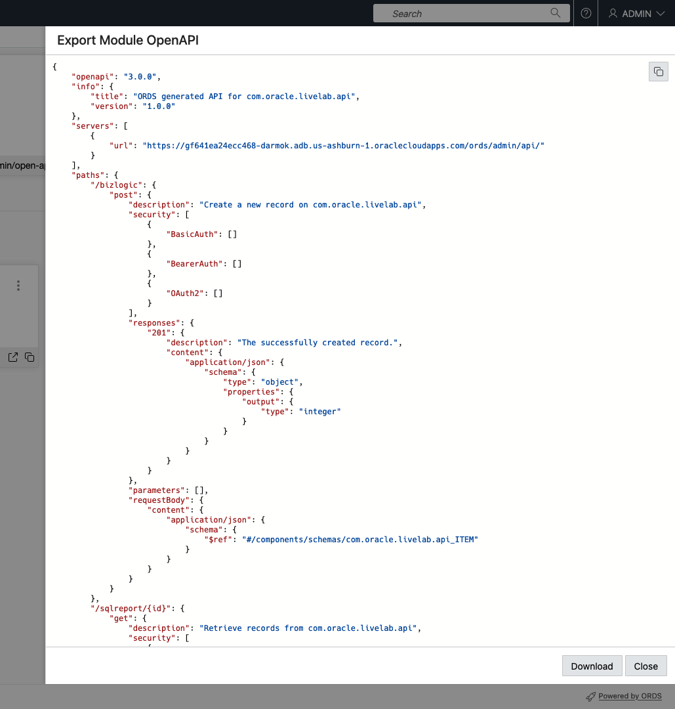


## Conclusion

In this lab, you published a REST API using custom SQL to accept an input as well as published a REST API using a stored PL/SQL procedure.

You may now [proceed to the next lab](#next).


## Acknowledgements


 - **Author** - Jeff Smith, Distinguished Product Manager
 - **Last Updated By/Date** - Jeff Smith, July 2022


